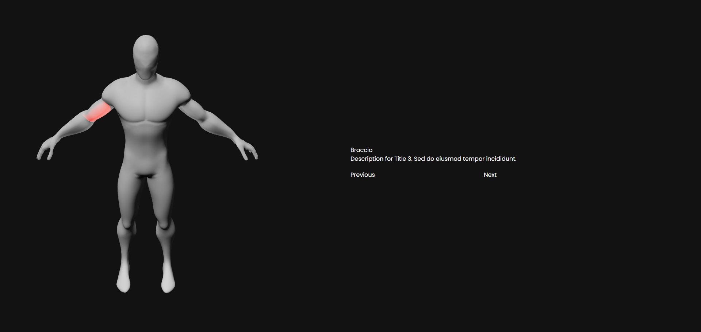

# human 3d model component



This project is a human 3D model component with a spotlight feature. The spotlight can be used to point focus on a specific zone of the body on click, similar to a slider that changes the focus. It provides an interactive way to explore different parts of the human body.

## Preview
You can see the preview [here](https://human-3d-component.vercel.app/)

### Technologies Used

[](https://reactjs.org/) [](https://vitejs.dev/) [](https://tailwindcss.com/)


## Installation

1. Clone the repository to your local machine:
```bash
git clone https://github.com/viraj-perera-development/human-3d-component.git
```

2. Navigate to the project directory:
```bash
cd human-3d-component
```

3. Install the required dependencies:
```bash
npm install
```

## Usage:

```bash
npm run dev
```
This command starts the development server. Open [here](http://localhost:5173) in your browser to view the application.


### Exposing to Network

To expose your project to the network, you can use the following command:

```bash 
npm run dev -- --host
```

This will allow other devices on the same network to access your project using your machine's IP address.


## Support

If you find this project useful and would like to support its development, consider buying me a ☕!

[](https://www.buymeacoffee.com/virajperera
)


## License

[MIT](https://github.com/viraj-perera-development/human-3d-component/blob/main/LICENSE)